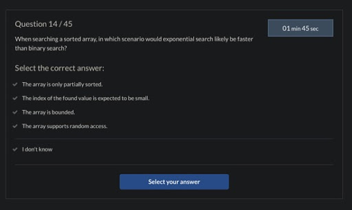

When searching a sorted array, in which scenario would exponential search likely be faster than binary search?

<ul>
<li>A). The array is only partially sorted.</li>
<li>B). The index of the found value is expected to be small.</li>
<li>C). The array is bounded.</li>
<li>D). The array supports random access.</li>
</ul>
 

Got most of my understanding from the links below:

<ul>
 <li><a href="https://stackoverflow.com/questions/52844293/exponential-search-vs-binary-search">learn about the difference between binary and exponential search methods</a></li>
 <li><a href="https://www.boost.org/doc/libs/1_40_0/libs/numeric/ublas/doc/bounded_array.htm">learn about bounded array</a></li>
 <li><a href="https://stackoverflow.com/questions/43126147/random-access-in-array">What's random access for an array</a></li>
</ul>

<ul>
<li>A). We can crosse out the option A since both of the searching methods rely on the array to be sorted.</li>
<li>b). To be more precise, if the returned index is less than Math.floor(Math.sqrt(arr.length)), exponential would be faster than binary search.</li>
<li>C). As for option C, a bounded array provides an advantage when resizing. While it's efficinet, it won't offer advantage to neither methods.</li>
<li>D). Random access would boost up the speed of both search methods while sequential access could provide some advantage to the exponential search.</li>
</ul>

</li>
